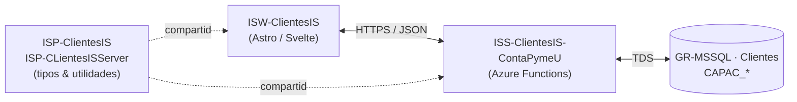

# ContaPymeU — Visión General

Este documento describe el módulo **Capacitación** del producto
**ContaPymeU**.
La documentación se centra **exclusivamente en Capacitación**: cursos,
planes de estudio, drivers, atributos, estructura, permisos, temas y la
relación plan-curso. Otros dominios del backend (recursos, mensajería)
solo se mencionan como **puntos de contacto** cuando aplica.

## Stack

| Capa | Proyecto | Tecnología |
| --- | --- | --- |
| Backend | `ISS-ClientesIS-ContaPymeU` | Azure Functions v4 (Node.js, TypeScript) |
| Tipos / Server util | `ISP-ClientesIS`, `ISP-CLientesISServer` | TypeScript (paquetes npm internos) |
| Frontend | `ISW-ClientesIS` | Astro 5 + Svelte + `@ingenieria_insoft/ispsveltecomponents` |
| Datos | `GR-MSSQL · Clientes` | SQL Server (tablas `CAPAC_*`) |

## Topología

## Convenciones

- **Naming SQL**: tablas con prefijo `CAPAC_*`, claves primarias con
  prefijo `i*` (ej. `ICURSO`, `IPLANESTUDIO`, `IDRIVER`).
- **Endpoints CRUD genéricos**: cada entidad expone hasta 9 acciones generadas
  por `registerCatalogoGenAzureFunction`:
  `Listar`, `Obtener`, `Verificar`, `Crear`, `Duplicar`, `Actualizar`,
  `Recodificar`, `Consolidar`, `Eliminar`.
- **Filtros**: el parámetro `:filtro` es un objeto JSON codificado en base64
  (`btoa(JSON.stringify({...}))`). El default `{}` es `e30=`.
- **Autenticación**: Bearer token (`{{token}}`) en todas las requests.
- **Generación automática**: la colección Postman y el OpenAPI YAML se regeneran
  desde el código de las funciones con `npm run swagger:gen`.

## Puntos de contacto con otros dominios

Capacitación **lee** información de otros dominios para enriquecer la
respuesta de un curso, pero **no implementa** su CRUD aquí:

- **Recursos** — un curso puede vincular un `IRECURSO` por plan.
  El endpoint `GET /api/curso/recursoplan/{icurso}` consulta el recurso
  asociado.
- **Mensajería** — los avisos del sistema se envían vía la mensajería
  transversal de ClientesIS; Capacitación solo emite eventos.
