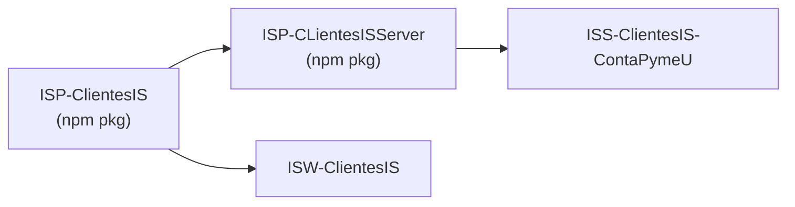

# ISP · Tipos compartidos

`ISP-ClientesIS` y `ISP-CLientesISServer` son los paquetes npm internos que
exportan los **contratos TypeScript** compartidos entre ISS y ISW.

> Esta sección lista únicamente los tipos relevantes para **Capacitación**.

## Paquetes

| Paquete | Audiencia | Contenido típico |
| --- | --- | --- |
| `@ingenieria_insoft/isp-clientesis` | Cliente / Server | Tipos `T*Server`, `T*Client`, enums, contratos DTO. |
| `@ingenieria_insoft/isp-clientesis-server` | Solo backend | Lógica server-side reusable (fetch helpers, mappers, validaciones). |

## Tipos de Capacitación

> Diagrama oficial: `public/imgs/Diagrama ORM (Mapeo Relacional de Objetos)1 (1).png`.
> Cada caja es una clase TypeScript en `ISP-ClientesIS`; los rombos llenos
> indican composición (la clase padre dueña de la lista de hijos).

## Convenciones de tipos

- Las clases de **objeto** del cliente extienden `TObject` / `TObjectBase`
  (`@ingenieria_insoft/ispgen`) y exponen un getter/setter por columna,
  con coerción explícita (`val2Str`, `val2Int`, `val2Bool`, `val2JSON`,
  `val2TArray`, `val2TObject`).
- Las clases con sufijo `*Server` viven en `ISP-CLientesISServer` y
  añaden la lógica de persistencia (consulta SQL anidada, inserciones
  encadenadas).
- Los **clientes HTTP** (sufijo `*Client`) viven en `ISP-ClientesIS` y
  encapsulan rutas, PKs y parsing de respuestas.

## Modelo del Curso (`TCurso`)

<!-- src path="ISP-ClientesIS/src/sources/010 Objetos/6.ContaPymeU/2.Capacitacion/02.Cursos/02.Datos.ts" lang="typescript" from="^export class TCurso\b" to="^}" -->

## Plan de Curso (`TPlanCurso`) y atributos polimórficos

`TPlanCurso` extiende `TRecurso` para heredar las propiedades de un
recurso externo, y mezcla atributos del plan con atributos del recurso en
el setter `atributos`.

<!-- src path="ISP-ClientesIS/src/sources/010 Objetos/6.ContaPymeU/2.Capacitacion/02.Cursos/02.Datos.ts" lang="typescript" from="^export class TPlanCurso\b" to="^}" -->

## Driver y atributos por driver

<!-- src path="ISP-ClientesIS/src/sources/010 Objetos/6.ContaPymeU/2.Capacitacion/02.Cursos/01.Modelo.ts" lang="typescript" from="^export class TDriver\b" to="^}" -->

<!-- src path="ISP-ClientesIS/src/sources/010 Objetos/6.ContaPymeU/2.Capacitacion/02.Cursos/01.Modelo.ts" lang="typescript" from="^export class TAtributosXDriver\b" to="^}" -->

## Cliente base de Capacitación

Todos los clientes Capacitación heredan de `TCapacitacionBaseClient`,
que centraliza el servicio remoto y el host (local vs. Azure).

<!-- src path="ISP-ClientesIS/src/sources/020 Controllers/6.ContaPymeU/2.Capacitacion/UlCapacitacionClient.ts" lang="typescript" from="^export abstract class TCapacitacionBaseClient\b" to="^}" -->

### Cliente Curso con endpoint custom

<!-- src path="ISP-ClientesIS/src/sources/020 Controllers/6.ContaPymeU/2.Capacitacion/UlCapacitacionClient.ts" lang="typescript" from="^export class TCursoClient\b" to="^}" -->

## Tema y Permiso (referencias livianas)

Algunas entidades son sólo etiquetas:

<!-- src path="ISP-ClientesIS/src/sources/010 Objetos/6.ContaPymeU/2.Capacitacion/130_UlTema.ts" lang="typescript" from="^export class TTema\b" to="^}" -->

<!-- src path="ISP-ClientesIS/src/sources/010 Objetos/6.ContaPymeU/2.Capacitacion/150_UlPermiso.ts" lang="typescript" from="^export class TPermiso\b" to="^}" -->

## Versionado

Los paquetes se versionan con SemVer y se publican al registry interno con
`pub.ps1`. ISS y ISW deben actualizar a la misma versión MAYOR para
mantener compatibilidad.

## Sincronización local con ISA

`scripts/fix-ispclientesis-index-dts.mjs` corrige paths absolutos en los
`*.d.ts` generados, y `sync-isp-clientesis.ps1` enlaza la build local a
ISS / ISW para iteración rápida.

