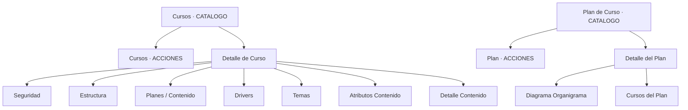

# ISW · Frontend (Astro + Svelte)

`ISW-ClientesIS` es la aplicación web del usuario final. Esta sección
solo describe las pantallas del módulo **Capacitación**.

## Estructura general

```
ISW-ClientesIS/
├── astro.config.mjs
├── web.config            (IIS deploy en App Service Windows)
├── public/
├── config/
└── src/
    ├── pages/            (rutas Astro)
    ├── components/       (.astro / .svelte)
    └── lib/              (clientes API, stores, helpers)
```

## Mapa de pantallas — Capacitación



## Cliente API

Todas las llamadas pasan por un wrapper en `src/lib/api/...`:

```ts
import { httpGet, httpPost } from "$lib/api/http";

const cursos = await httpGet<TCursoClient[]>(
  `/api/cursos/${btoa(JSON.stringify({ activo: true }))}`,
);
```

El wrapper inyecta `Authorization: Bearer ${token}` y maneja errores
estándar con toasts (`ispsveltecomponents` Toaster).

## Componentes UI clave

`Card`, `Button`, `Modal`, `Tabs`, `TabItem`, `FlexLayout`, `GridLayout`,
`H4`, `Text`, `Iconify`, `Loading`.

Variables CSS globales: `--is-bg-primary`, `--is-bg-secondary`,
`--is-color`, `--is-primary`, `--is-b-color`, `--is-bg-readonly`.

## Deploy

`pub.ps1` empaqueta el sitio Astro y lo publica como App Service Windows
con `web.config` para SSR/Node.

## Integración con ISA

ISA puede correr `npm run dev` / `build` / `pub.ps1` desde la pestaña
**Proyectos → ContaPymeU → Acciones**.
