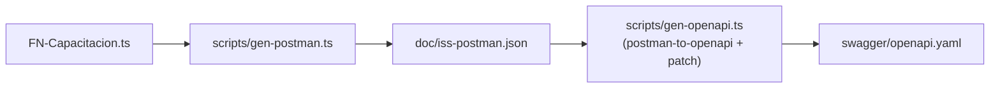

# Postman · OpenAPI

El microservicio mantiene **una sola fuente de verdad**: el código de las
funciones (`src/functions/FN-Capacitacion.ts`). Desde ahí se generan
automáticamente la colección Postman y la especificación OpenAPI para
Capacitación.

## Pipeline



## Scripts npm

| Comando | Resultado |
| --- | --- |
| `npm run postman:gen` | Reescribe `doc/iss-postman.json`. Preserva `description` y `response[]` previos por endpoint. |
| `npm run swagger:gen` | Encadena `postman:gen` y luego genera `swagger/openapi.yaml` con `postman-to-openapi`, post-procesado para convertir `:var → {var}` y enriquecer parámetros de path. |

## Detección automática

`gen-postman.ts` reconoce dos patrones en el código:

### 1. CRUD generado

```ts
registerCatalogoGenAzureFunction(ServerType, ClientType, {
  pk: ["icurso"],
  nrecurso: "curso",
  nrecursos: "cursos",
  omitir: ["Duplicar"],
});
```

→ produce hasta 9 endpoints (los listados en
[`03-iss-overview`](#03-iss-overview)).

### 2. Endpoints custom

```ts
app.get("API_GET_CursoRecursoPlan", {
  route: "curso/recursoplan/{icurso}",
  authLevel: "anonymous",
  handler,
});
```

→ produce un item Postman con método y ruta literales.

## Cuerpos de ejemplo (`BODY_EXTRAS`)

`gen-postman.ts` define un mapa `BODY_EXTRAS` por `nrecurso` con ejemplos
representativos del body para Capacitación. Si una entidad nueva no está
en ese mapa, el generador crea un body mínimo solo con las PKs e imprime
un warning para que se complete manualmente.

## Variables de path

Para cada placeholder (`:var` / `{var}`) el generador inyecta:

- **Postman**: `request.url.variable[]` con `key`, `value` (sample) y
  `description`.
- **OpenAPI**: `parameters[].in: path` con `required: true`, `example`,
  `description` y `schema.type: string`.

## Convenciones de samples

| Tipo de variable | Sample |
| --- | --- |
| `filtro` | `e30=` (base64 de `{}`) |
| `qnivel` / `inivel` | `1` |
| `i*` (PKs string) | `KEY001`, `CURSO001`, etc. |

## Cómo agregar una nueva entidad de Capacitación

1. Crear los tipos en `ISP-ClientesIS`.
2. Implementar el controlador y el cliente en `ISS-ClientesIS-ContaPymeU`.
3. Registrar la entidad en `FN-Capacitacion.ts`:
   ```ts
   registerCatalogoGenAzureFunction(MyServer, MyClient, {
     pk: ["imientidad"],
     nrecurso: "mientidad",
     nrecursos: "mientidades",
   });
   ```
4. (Opcional) Añadir un `BODY_EXTRAS["mientidad"]` con un ejemplo de
   creación realista.
5. Ejecutar `npm run swagger:gen`.
6. Verificar `doc/iss-postman.json` y `swagger/openapi.yaml`.
7. Importar la colección en Postman y validar con `{{token}}`.

## Cómo agregar un endpoint custom

1. Declararlo con `app.get("API_GET_...", { route: "...", handler })`.
2. Asegurar que el `route` use `{var}` o `{var?}` (Azure Functions acepta
   ambos) — el generador convierte ambos.
3. Ejecutar `npm run swagger:gen`.

## Visualización

`FN-Swagger.ts` sirve la UI de Swagger en `/api/swagger`, leyendo
`swagger/openapi.yaml`. La pestaña **Postman Docs** de ISA renderiza la
colección como tabla navegable.
