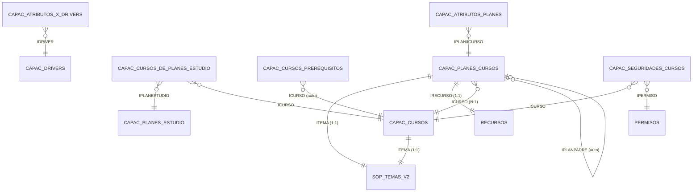

# Modelo de Datos

Tablas SQL Server del módulo **Capacitación**. Todas usan el prefijo
`CAPAC_*`. Las tablas de otros dominios (recursos, mensajería) **no** se
documentan aquí; solo aparecen como FK externas cuando una tabla de
Capacitación las referencia.

## DER (diagrama oficial)


> El esquema completo se encuentra en
> `public/imgs/DER Capacitación.jpg`. `RECURSO_EXTERNO` (cuando aparece)
> representa una FK lógica al dominio de Recursos; no es una tabla
> `CAPAC_*`.

## Propagación GET / UPDATE

Las tres APIs de Capacitación que ejecutan `GET` (`driver`, `curso`,
`plan/estudio`) propagan la lectura **a todo el dominio**: dentro de
Capacitación todo se conecta con todo y solo se corta al salir del
dominio (p. ej. `RECURSOS`). Los colores sobre las tablas en el
diagrama identifican qué API origina cada cadena de anidamiento.


En `UPDATE` (incluye `CREATE` y `DELETE`) sí hay disrupciones: cada
API **solo modifica su propio sub-dominio**. `Plan` no actualiza
tablas de `Curso` ni de `Driver`, y viceversa. Las equis rojas marcan
explícitamente las tablas que quedan **fuera** del mapa de
propagación de escritura de cada API.


> Regla derivada: una operación de escritura sobre una tabla que
> pertenezca a otro sub-dominio debe ejecutarse a través de su propia
> API. No se permite escribir en cascada cruzando fronteras de
> dominio aunque el GET sí lo lea anidado.

## Tablas

### `CAPAC_CURSOS`

Catálogo de cursos.

| Columna | Tipo | Descripción |
| --- | --- | --- |
| `ICURSO` (PK) | `varchar(10)` | Identificador del curso. |
| `NCURSO` | `varchar(10)` | Nombre corto. |
| `ITEMA` | `varchar(25)` | FK → `SOP_TEMAS_V2` (dominio Soporte). |
| `IDRIVER` | `smallint` | FK → `CAPAC_DRIVERS`. |
| `DESCRIPCION` | `varchar(max)` | Descripción larga. |
| `BACTIVO` | `bit` | Activo / inactivo. |
| auditoría | `IUSUARIOCRE`, `IAPPCRE`, `IPCRE`, `FHCRE` | Usuario / app / IP / fecha de creación. |

### `CAPAC_PLANES_ESTUDIO`

| Columna | Tipo | Notas |
| --- | --- | --- |
| `IPLANESTUDIO` (PK) | `varchar(255)` | |
| `NOMBRE` | `varchar(255)` | |
| `DESCRIPCIONPLAN` | `text` | |
| `TTDVISUALIZACION` | `varchar(50)` | `ARBOL`, `LINEAL`, … |
| `BGENERACERTIFICADOG` | `bit` | Si emite certificado. |
| `BACTIVO` | `int` | |
| auditoría | … | |

### `CAPAC_CURSOS_DE_PLANES_ESTUDIO`

| Columna | Tipo |
| --- | --- |
| `IPLANESTUDIO` (PK, FK) | `varchar(255)` |
| `ICURSO` (PK, FK) | `varchar(10)` |
| `BREQUERIDO` | `bit` |
| `QORDEN` | `int` |

### `CAPAC_CURSOS_PREREQUISITOS`

| Columna | Tipo |
| --- | --- |
| `IPLANESTUDIO` (PK) | `varchar(255)` |
| `ICURSO` (PK) | `varchar(10)` |
| `CURSOSICURSO` (PK) | `varchar(10)` — curso requerido |

### `CAPAC_DRIVERS`

| Columna | Tipo |
| --- | --- |
| `IDRIVER` (PK) | `smallint` |
| `NDRIVER` | `varchar(10)` |
| `DESCRIPCION` | `varchar(max)` |
| `QNIVELES` | `tinyint` |

### `CAPAC_ATRIBUTOS_X_DRIVERS`

| Columna | Tipo |
| --- | --- |
| `IDRIVER` (PK) | `smallint` |
| `IATRIBUTO` (PK) | `smallint` |
| `QNIVEL` | `tinyint` |
| `NATRIBUTO` | `varchar(50)` |
| `TDATRIBUTO` | `varchar(50)` |
| `BREQUERIDO` | `bit` |
| `JCONFIG` | `varchar(max)` (JSON) |

### `CAPAC_ATRIBUTOS_PLANES`

| Columna | Tipo |
| --- | --- |
| `IATRIBUTO` (PK) | `smallint` |
| `ICURSO` (PK) | `varchar(10)` |
| `IPLAN` (PK) | `varchar(100)` |
| `VALOR` | `varchar(max)` |

### `CAPAC_ESTRUCTURAS_CURSOS`

| Columna | Tipo |
| --- | --- |
| `ICURSO` (PK) | `varchar(10)` |
| `QNIVEL` (PK) | `tinyint` |
| `NNIVEL` | `varchar(250)` |

> **Nota helper**: en URLs el helper traduce `qnivel` → `inivel` para
> mantener coherencia con el patrón de PKs `i*`. El body sigue usando
> `qnivel`.

### `CAPAC_PLANES_CURSOS`

| Columna | Tipo |
| --- | --- |
| `IPLAN` (PK) | `varchar(100)` |
| `ICURSO` (PK) | `varchar(10)` |
| `ITEMA` | `varchar(25)` |
| `IRECURSO` | `bigint` (FK lógica — dominio externo) |
| `IPLANPADRE` | `varchar(100)` |
| `TITULO` | `varchar(255)` |

### `CAPAC_SEGURIDADES_CURSOS`

| Columna | Tipo |
| --- | --- |
| `ICURSO` (PK) | `varchar(10)` |
| `IPERMISO` (PK) | `varchar(25)` |

### `CAPAC_PERMISOS`

| Columna | Tipo |
| --- | --- |
| `IPERMISO` (PK) | `varchar(25)` |
| `NPERMISO` | `varchar(255)` |

### `SOP_TEMAS_V2`

> Catálogo de temas del dominio **Soporte** (no `CAPAC_*`). Se referencia
> como FK externa desde `CAPAC_CURSOS.ITEMA` y `CAPAC_PLANES_CURSOS.ITEMA`.

| Columna | Tipo |
| --- | --- |
| `ITEMA` (PK) | `varchar(25)` |
| `NTEMA` | `varchar(255)` |
| auditoría | `IUSUARIOCRE`, `APPCRE`, `IPCRE`, `FHCRE` |

## Mapeo Relacional de Objetos (ORM)

Además de la estructura SQL pura, el modelo cliente expresa
**herencia entre entidades** para que ciertas tablas de Capacitación
se comporten como otra entidad del dominio. El siguiente diagrama
resume las herencias y los pivotes del módulo.




### Herencia `TPlanCurso` extends `TRecurso`

`CAPAC_PLANES_CURSOS` lleva una FK `IRECURSO` hacia `RECURSOS` (dominio
externo) y, a nivel de objeto, **`TPlanCurso` hereda de `TRecurso`**:
el sistema trata un plan-curso como si fuera un recurso, exponiendo
además un accesor explícito `recurso` (1-1 por `IRECURSO`) que se
materializa con `Get_Recurso_PlanCurso`.

Esta particularidad se declara en el JSON de la tabla
(`tablemeta.extendsmodel: "Recurso"`) y el generador de snippets emite
`export class TPlanCurso extends TRecurso { … }` en vez del `TObject`
por defecto.

### Pivotes (tablas puente)

- `CAPAC_CURSOS_DE_PLANES_ESTUDIO` — pivote `PLANES_ESTUDIO` ↔ `CURSOS`.
- `CAPAC_CURSOS_PREREQUISITOS` — pivote `CURSOS` ↔ `CURSOS` (auto-relación).
- `CAPAC_ATRIBUTOS_X_DRIVERS` — pivote `DRIVERS` ↔ atributos.
- `CAPAC_ATRIBUTOS_PLANES` — pivote `PLANES_CURSOS` ↔ atributos.
- `CAPAC_SEGURIDADES_CURSOS` — pivote `CURSOS` ↔ `PERMISOS`.

## Reglas de integridad relevantes

- `CAPAC_CURSOS.ITEMA` → `SOP_TEMAS_V2` (1:1).
- `CAPAC_PLANES_CURSOS.ITEMA` → `SOP_TEMAS_V2` (1:1).
- `CAPAC_PLANES_CURSOS.IRECURSO` → `RECURSOS` (1:1, base de la herencia `TPlanCurso extends TRecurso`).
- `CAPAC_CURSOS_DE_PLANES_ESTUDIO.IPLANESTUDIO` → `CAPAC_PLANES_ESTUDIO`.
- `CAPAC_CURSOS_DE_PLANES_ESTUDIO.ICURSO` → `CAPAC_CURSOS`.
- `CAPAC_PLANES_CURSOS.ICURSO` → `CAPAC_CURSOS`.
- `CAPAC_ATRIBUTOS_PLANES.ICURSO` / `.IPLAN` → cursos / planes.
- Borrado de un **Curso** debe cascar (lógicamente) en sus
  estructuras, atributos, planes-cursos y seguridades.

## DDL de referencia

Los siguientes fragmentos se leen **en vivo** desde
`doc/init_capacitacion.sql`; cualquier cambio en el script se refleja
inmediatamente al recargar.

### `CAPAC_DRIVERS`

```sql
> ⚠ `doc/init_capacitacion.sql`: ENOENT: no such file or directory, open 'C:\Users\JAGUDELOE\Documents\doc\init_capacitacion.sql'
```

### `CAPAC_CURSOS`

```sql
> ⚠ `doc/init_capacitacion.sql`: ENOENT: no such file or directory, open 'C:\Users\JAGUDELOE\Documents\doc\init_capacitacion.sql'
```

### `CAPAC_PLANES_ESTUDIO`

```sql
> ⚠ `doc/init_capacitacion.sql`: ENOENT: no such file or directory, open 'C:\Users\JAGUDELOE\Documents\doc\init_capacitacion.sql'
```

### Tablas pivote (PKs compuestas)

```sql
> ⚠ `doc/init_capacitacion.sql`: ENOENT: no such file or directory, open 'C:\Users\JAGUDELOE\Documents\doc\init_capacitacion.sql'
```

```sql
> ⚠ `doc/init_capacitacion.sql`: ENOENT: no such file or directory, open 'C:\Users\JAGUDELOE\Documents\doc\init_capacitacion.sql'
```

```sql
> ⚠ `doc/init_capacitacion.sql`: ENOENT: no such file or directory, open 'C:\Users\JAGUDELOE\Documents\doc\init_capacitacion.sql'
```

```sql
> ⚠ `doc/init_capacitacion.sql`: ENOENT: no such file or directory, open 'C:\Users\JAGUDELOE\Documents\doc\init_capacitacion.sql'
```

### Secuencias

```sql
> ⚠ `doc/init_capacitacion.sql`: ENOENT: no such file or directory, open 'C:\Users\JAGUDELOE\Documents\doc\init_capacitacion.sql'
```
