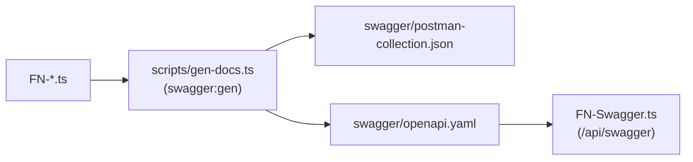

# ISS · Backend (Azure Functions)

`ISS-ClientesIS-ContaPymeU` es el microservicio que expone el dominio
**Capacitación** como **Azure Functions v4** sobre Node.js + TypeScript.

> Esta documentación cubre solo lo correspondiente a Capacitación
> (`FN-Capacitacion.ts` y archivos auxiliares como `FN-Swagger.ts`,
> `XXX-Info.ts`). Otras `FN-*` que viven en el mismo proceso no se
> documentan aquí.

## Estructura del proyecto (relevante)

```
ISS-ClientesIS-ContaPymeU/
├── host.json
├── local.settings.json          (no comiteado: secretos en dev)
├── package.json
├── tsconfig.json
├── scripts/
│   ├── gen-postman.ts           (genera doc/iss-postman.json desde FN-*.ts)
│   ├── gen-openapi.ts           (genera swagger/openapi.yaml + parchea path params)
│   └── postman-store.ts         (split/merge de la colección Postman)
├── src/
│   └── functions/
│       ├── FN-Capacitacion.ts   ← módulo Capacitación
│       ├── FN-Swagger.ts
│       └── XXX-Info.ts
└── swagger/
    └── openapi.yaml             (generado)
```

## Scripts npm

| Script | Acción |
| --- | --- |
| `npm run start` | Levanta `func start` localmente. |
| `npm run docs:gen` | Genera Postman + OpenAPI en una sola corrida. |
| `npm run swagger:gen` / `postman:gen` / `postman:sync` | Aliases del anterior (compat). |
| `npm run test` | Lint con `oxlint`. |

> El script consolidado es `scripts/gen-docs.ts`, que importa los `main()`
> de `gen-postman.ts` y `gen-openapi.ts`.

## Generador de endpoints CRUD

Se utiliza el helper `registerCatalogoGenAzureFunction` de
`@ingenieria_insoft/ispazureutils`:

```ts
registerCatalogoGenAzureFunction(ServerType, ClientType, {
  pk:        ["icurso"],
  nrecurso:  "curso",      // singular (default: pk[0] sin la 'i')
  nrecursos: "cursos",     // plural   (default: nrecurso + 's')
  omitir:    ["Duplicar"], // opciones: Listar, Obtener, Verificar, Crear,
                           // Duplicar, Actualizar, Recodificar, Consolidar,
                           // Eliminar
});
```

Esto genera automáticamente:

| Operación | Método | Ruta |
| --- | --- | --- |
| Listar | `GET` | `/api/{nrecursos}/:filtro` |
| Obtener | `GET` | `/api/{nrecurso}/:pk1[/:pk2…]` |
| Verificar | `GET` | `/api/{nrecurso}/verificar/:pk1[/…]` |
| Crear | `POST` | `/api/{nrecurso}` |
| Duplicar | `POST` | `/api/{nrecurso}/duplicar/:pk1[/…]` |
| Actualizar | `PUT` | `/api/{nrecurso}/:pk1[/…]` |
| Recodificar | `PUT` | `/api/{nrecurso}/recodificar/:pk1[/…]` |
| Consolidar | `PUT` | `/api/{nrecurso}/consolidar/:pk1[/…]` |
| Eliminar | `DELETE` | `/api/{nrecurso}/:pk1[/…]` |

## Convenciones de filtros

`:filtro` siempre es base64 de un objeto JSON:

```ts
const filtro = btoa(JSON.stringify({ activo: true, texto: "java" }));
fetch(`/api/cursos/${filtro}`);
```

Default `{}` → `e30=`.

## Autenticación

Todos los endpoints requieren `Authorization: Bearer {{token}}`.

## Rutas custom (Capacitación)

| Función | Método | Ruta |
| --- | --- | --- |
| `API_GET_CursoRecursoPlan` | GET | `/api/curso/recursoplan/{icurso}` |

> Esta ruta consulta el **recurso** asociado al plan del curso. El recurso
> en sí mismo pertenece a otro dominio; aquí solo se realiza la lectura
> de enlace.

## Registro de entidades · `FN-Capacitacion.ts`

Todas las entidades de Capacitación se registran en un único archivo. El
código es declarativo y produce 9 endpoints CRUD por cada llamada. El
fragmento se lee **en vivo** desde el repo `ISS-ClientesIS-ContaPymeU`,
así que cualquier alta o cambio aparece aquí sin tocar la documentación.

```typescript
registerCatalogoGenAzureFunction(TCursoServer, TCurso, { pk: ["icurso"], nrecurso: "curso", nrecursos: "cursos" });
registerCatalogoGenAzureFunction(TPlanEstudioServer, TPlanDeEstudio, { pk: ["iplanestudio"], nrecurso: "plan/estudio", nrecursos: "planes/estudio" });
registerCatalogoGenAzureFunction(TDriverServer, TDriver, { pk: ["idriver"], nrecurso: "driver", nrecursos: "drivers", omitir: ["Verificar", "Duplicar", "Recodificar", "Consolidar"] });

// Catálogos RelNoSysrecurso (lectura sin seguridad, mutaciones no-op).
// Se exponen para alimentar componentes BtnRef desde el front.
// Solo se exponen Obtener (Visualizar) y Listar; el resto se omite.
registerCatalogoGenAzureFunction(TPermisoServer, TPermiso, { pk: ["ipermiso"], nrecurso: "permiso", nrecursos: "permisos", omitir: ["Crear", "Modificar", "Eliminar", "Verificar", "Duplicar", "Recodificar", "Consolidar"] });

app.get("API_GET_CursoRecursoPlan", {
	route: "curso/recursoplan/{icurso}",
	handler: async (request: HttpRequest, context: InvocationContext): Promise<HttpResponseInit> => {
		const Ctx = new TCursoServer(request, context);
		const { CtxUser } = Ctx;
		let ResponseData: TResponseData = await CtxUser.PrepareRequest();
		try {
			const curso = Object.assign(new TCurso(), CtxUser.params);
			await Ctx.Get_Recurso_PlanCurso(curso);
			ResponseData = RstExitosa({ body: { datos: curso } });
		} catch (error) { ResponseData = RstError(error) }
		return Ctx.SendResponse(ResponseData, false);
	},
});

app.get("API_GET_PlanDeEstudioDetalle", {
	route: "plan/estudio/detalle/{iplanestudio}",
	handler: async (request: HttpRequest, context: InvocationContext): Promise<HttpResponseInit> => {
		const Ctx = new TPlanEstudioServer(request, context);
		const { CtxUser } = Ctx;
		let ResponseData: TResponseData = await CtxUser.PrepareRequest();
		try {
			const planEstudio =  TPlanDeEstudio.JSONToObject({
				iplanestudio: CtxUser.params.iplanestudio
			}) as TPlanDeEstudio;

			await Ctx.obtenerDetallePlanEstudio(planEstudio);
			ResponseData = RstExitosa({ body: { datos: planEstudio } });
		} catch (error) { ResponseData = RstError(error) }
		return Ctx.SendResponse(ResponseData, false);
	},
});


```

### Endpoint custom (recurso del plan)

```typescript
app.get("API_GET_CursoRecursoPlan", {
	route: "curso/recursoplan/{icurso}",
	handler: async (request: HttpRequest, context: InvocationContext): Promise<HttpResponseInit> => {
		const Ctx = new TCursoServer(request, context);
		const { CtxUser } = Ctx;
		let ResponseData: TResponseData = await CtxUser.PrepareRequest();
		try {
			const curso = Object.assign(new TCurso(), CtxUser.params);
			await Ctx.Get_Recurso_PlanCurso(curso);
			ResponseData = RstExitosa({ body: { datos: curso } });
		} catch (error) { ResponseData = RstError(error) }
		return Ctx.SendResponse(ResponseData, false);
	},
});
```

## Pipeline de documentación



## Variables de entorno

| Clave | Descripción |
| --- | --- |
| `MSSQL_HOST` / `MSSQL_USER` / `MSSQL_PASSWORD` / `MSSQL_DB` | Conexión BD. |
| `JWT_SECRET` o equivalente | Validación de tokens. |
| `CORS_ORIGINS` | Lista de orígenes permitidos. |

> Ver `README_CONEXION_BD.md` para la guía completa de conexión.
