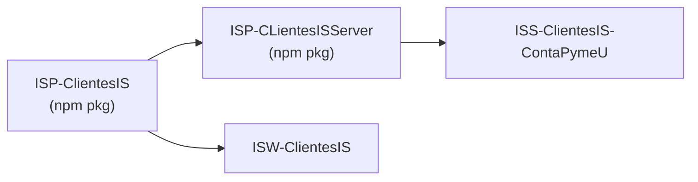

# ISP · Tipos compartidos

`ISP-ClientesIS` y `ISP-CLientesISServer` son los paquetes npm internos que
exportan los **contratos TypeScript** compartidos entre ISS y ISW.

> Esta sección lista únicamente los tipos relevantes para **Capacitación**.

## Paquetes

| Paquete | Audiencia | Contenido típico |
| --- | --- | --- |
| `@ingenieria_insoft/isp-clientesis` | Cliente / Server | Tipos `T*Server`, `T*Client`, enums, contratos DTO. |
| `@ingenieria_insoft/isp-clientesis-server` | Solo backend | Lógica server-side reusable (fetch helpers, mappers, validaciones). |

## Tipos de Capacitación


> Diagrama oficial: `public/imgs/Diagrama ORM (Mapeo Relacional de Objetos)1 (1).png`.
> Cada caja es una clase TypeScript en `ISP-ClientesIS`; los rombos llenos
> indican composición (la clase padre dueña de la lista de hijos).

## Convenciones de tipos

- Las clases de **objeto** del cliente extienden `TObject` / `TObjectBase`
  (`@ingenieria_insoft/ispgen`) y exponen un getter/setter por columna,
  con coerción explícita (`val2Str`, `val2Int`, `val2Bool`, `val2JSON`,
  `val2TArray`, `val2TObject`).
- Las clases con sufijo `*Server` viven en `ISP-CLientesISServer` y
  añaden la lógica de persistencia (consulta SQL anidada, inserciones
  encadenadas).
- Los **clientes HTTP** (sufijo `*Client`) viven en `ISP-ClientesIS` y
  encapsulan rutas, PKs y parsing de respuestas.

## Modelo del Curso (`TCurso`)

```typescript
export class TCurso extends TObjectBase {
	// PK
	get icurso(): string { return this.f.icurso }
	set icurso(v: any) { this.f.icurso = val2Str(v) }
	// FK
	get itema(): string { return this.f.itema }
	set itema(v: any) { this.f.itema = val2Str(v) }
	get idriver(): number { return this.f.idriver }
	set idriver(v: any) { this.f.idriver = val2Int(v) }
	get bgeneracertificado(): boolean { return this.f.bgeneracertificado }
	set bgeneracertificado(v: any) { this.f.bgeneracertificado = val2Bool(v) }
	// PROPIEDADES
	get ncurso(): string { return this.f.ncurso }
	set ncurso(v: any) { this.f.ncurso = val2Str(v) }
	get descripcion(): string { return this.f.descripcion }
	set descripcion(v: any) { this.f.descripcion = val2Str(v) }
	get bactivo(): boolean { return this.f.bactivo }
	set bactivo(v: any) { this.f.bactivo = val2Bool(v) }

	// SOP_TEMAS_V2
	get tema(): TTemaSoporte { return this.f.tema }
	set tema(v: any) { this.f.tema = val2TObject(v, TTemaSoporte) }
	// CAPAC_DRIVERS
	get driver(): TDriver { return this.f.driver }
	set driver(v: any) { this.f.driver = val2TObject(v, TDriver) }
	// CAPAC_SEGURIDADES_CURSOS
	get seguridades(): TArray<TSeguridadCurso> { return this.f.seguridades }
	set seguridades(v: any) { this.f.seguridades = val2TArray(v, TSeguridadCurso) }
	// CAPAC_CURSOS_PREREQUISITOS
	get cursosrequisitos(): TCursoPrerequisito { return this.f.cursosrequisitos }
	set cursosrequisitos(v: any) { this.f.cursosrequisitos = val2TObject(v, TCursoPrerequisito) }
	// CAPAC_ESTRUCTURAS_CURSOS
	get estructuras(): TArray<TEstructuraCurso> { return this.f.estructuras }
	set estructuras(v: any) { this.f.estructuras = val2TArray(v, TEstructuraCurso) }
	// CAPAC_PLANES_CURSOS
	get planescurso(): TArray<TPlanCurso> { return this.f.planescurso }
	set planescurso(v: any) { this.f.planescurso = val2TArray(v, TPlanCurso) }

	// helpers
	public get qprogreso(): number { return this.f.qprogreso }
	public set qprogreso(v: any) { this.f.qprogreso = val2Int(v) }

	public get qtotalrecursos(): number { return this.f.qtotalrecursos }
	public set qtotalrecursos(v: any) { this.f.qtotalrecursos = val2Int(v) }

	public get qrecursosfinalizados(): number { return this.f.qrecursosfinalizados }
	public set qrecursosfinalizados(v: any) { this.f.qrecursosfinalizados = val2Int(v) }

	public get qduracion(): number { return this.f.qduracion }
	public set qduracion(v: any) { this.f.qduracion = val2Int(v) }

	public get qcalificacion(): number { return this.f.qcalificacion }
	public set qcalificacion(v: any) { this.f.qcalificacion = val2Int(v) }

	public get qtotalCalificaciones(): number { return this.f.qtotalCalificaciones }
	public set qtotalCalificaciones(v: any) { this.f.qtotalCalificaciones = val2Int(v) }
}
```

## Plan de Curso (`TPlanCurso`) y atributos polimórficos

`TPlanCurso` extiende `TRecurso` para heredar las propiedades de un
recurso externo, y mezcla atributos del plan con atributos del recurso en
el setter `atributos`.

```typescript
export class TPlanCurso extends TRecurso {
	// PK
	get iplan(): string { return this.f.iplan }
	set iplan(v: any) { this.f.iplan = val2Str(v) }

	// FK
	get icurso(): string { return this.f.icurso }
	set icurso(v: any) { this.f.icurso = val2Str(v) }
	get itema(): string { return this.f.itema }
	set itema(v: any) { this.f.itema = val2Str(v) }
	/* get irecurso(): number { return this.f.irecurso }
	set irecurso(v: any) { this.f.irecurso = val2Int(v) } */

	// PROPIEDADES
	get titulo(): string { return this.f.titulo }
	set titulo(v: any) { this.f.titulo = val2Str(v) }

	// CAPAC_RECURSOS (detalle por IRECURSO)
	get recurso(): TRecurso { return this.f.recurso }
	set recurso(v: any) { this.f.recurso = val2TObject(v, TRecurso) }
	// CAPAC_ATRIBUTOS_PLANES
	get atributosplan(): TArray<TAtributosPlan> { return this.f.atributosplan }
	set atributosplan(v: any) { this.f.atributosplan = val2TArray(Array.isArray(v) ? v.filter(Boolean) : v, TAtributosPlan) }
	// CAPAC_ESTRUCTURAS_CURSOS (solo consulta contextual)
	get estructuranivel(): TEstructuraCurso { return this.f.estructuranivel }
	set estructuranivel(v: any) { this.f.estructuranivel = val2TObject(v, TEstructuraCurso) }

	get atributos(): TArray<TAtributosPlan | TAtributoRecurso> { return this.f.atributos }
	set atributos(v: any) {
		const lista = Array.isArray(v) ? v : [];
		this.f.atributos = new TArray<TAtributosPlan | TAtributoRecurso>(lista.map((item: TAtributosPlan | TAtributoRecurso) => "irecurso" in item ? val2TObject(item, TAtributoRecurso) : val2TObject(item, TAtributosPlan)))
	}

	// helpers
	get qnivel(): number { return this.iplan ? String(this.iplan).split(".").filter(Boolean).length : 0 }
}
```

## Driver y atributos por driver

```typescript
export class TDriver extends TObject {
	// PK
	get idriver(): number { return this.f.idriver }
	set idriver(v: any) { this.f.idriver = val2Int(v) }
	// PROPIEDADES
	get ndriver(): string { return this.f.ndriver }
	set ndriver(v: any) { this.f.ndriver = val2Str(v) }
	get descripcion(): string { return this.f.descripcion }
	set descripcion(v: any) { this.f.descripcion = val2Str(v) }
	get qniveles(): number { return this.f.qniveles }
	set qniveles(v: any) { this.f.qniveles = val2Int(v) }

	// CAPAC_ATRIBUTOS_X_DRIVERS
	get atributos(): TArray<TAtributosXDriver> { return this.f.atributos }
	set atributos(v: any) { this.f.atributos = val2TArray(v, TAtributosXDriver) }
}
```

```typescript
export class TAtributosXDriver extends TObject {
	// PK
	get iatributo(): number { return this.f.iatributo }
	set iatributo(v: any) { this.f.iatributo = val2Int(v) }
	// FK
	get idriver(): number { return this.f.idriver }
	set idriver(v: any) { this.f.idriver = val2Int(v) }
	// Propiedades
	get qnivel(): number { return this.f.qnivel }
	set qnivel(v: any) { this.f.qnivel = val2Int(v) }
	get natributo(): string { return this.f.natributo }
	set natributo(v: any) { this.f.natributo = val2Str(v) }
	get tdatributo(): TTDAtributo { return this.f.tdatributo }
	set tdatributo(v: any) { this.f.tdatributo = val2NumericEnum(v, TTDAtributo.none, TTDAtributo) }
	get brequerido(): boolean { return this.f.brequerido }
	set brequerido(v: any) { this.f.brequerido = val2Bool(v) }
	get jconfig(): Record<string, unknown> { return this.f.jconfig }
	set jconfig(v: any) { this.f.jconfig = val2JSON(v); }

	// CAPAC_DRIVERS
	get driver(): TDriver { return this.f.driver }
	set driver(v: any) { this.f.driver = val2TObject(v, TDriver) }
}
```

## Cliente base de Capacitación

Todos los clientes Capacitación heredan de `TCapacitacionBaseClient`,
que centraliza el servicio remoto y el host (local vs. Azure).

```typescript
export abstract class TCapacitacionBaseClient<T extends TObject> extends TClienteSistemasClientes<T> {
	static local = false;
	public override get NServer(): ServiciosInSoft { return "clientesis-capacitacion" as any; }
	public get InfoConnection(): TInfoConnection {
		if (TCapacitacionBaseClient.local) {
			return {
				host: "localhost", port: 20040, https: false, restcontext: ""
			}
		}
		return {
			host: "clientesis-contapymeu.azurewebsites.net", port: 443, https: true, restcontext: ""
		}
	}
}
```

### Cliente Curso con endpoint custom

```typescript
export class TCursoClient extends TCapacitacionBaseClient<TCurso> {
	public get NEndPoint(): string { return "/api/curso" }
	public get NEndPointListado(): string { return "/api/cursos" }
	public get Klass(): typeof TCurso { return TCurso }
	public get PrimaryKeys(): Array<keyof TCurso> { return ["icurso"] }

	public async recursoPlan(curso: TCurso, timeOut: number = 30000): Promise<boolean> {
		let path: string = `/api/curso/recursoplan/${curso.icurso}`;
		let res = await this.Request("GET", path, null, timeOut);
		let resJSON: any = val2JSON(res.responseText, {});
		if (this.verifyResponse(res)) {
			curso.loadFromJSON(resJSON.respuesta?.datos || {});
			return true;
		}
		throw new Error(resJSON.encabezado?.mensaje);
	}
}
```

## Tema y Permiso (referencias livianas)

Algunas entidades son sólo etiquetas:

```typescript
> ⚠ `ISP-ClientesIS/src/sources/010 Objetos/6.ContaPymeU/2.Capacitacion/130_UlTema.ts`: ENOENT: no such file or directory, open 'C:\Users\JAGUDELOE\Documents\Contapyme\ClientesIS\ISP-ClientesIS\src\sources\010 Objetos\6.ContaPymeU\2.Capacitacion\130_UlTema.ts'
```

```typescript
export class TPermiso extends TObjectBase {
	// CAPAC_PERMISOS
	get ipermiso(): string { return this.f.ipermiso }
	set ipermiso(v: any) { this.f.ipermiso = val2Str(v) }
	get npermiso(): string { return this.f.npermiso }
	set npermiso(v: any) { this.f.npermiso = val2Str(v) }
}
```

## Versionado

Los paquetes se versionan con SemVer y se publican al registry interno con
`pub.ps1`. ISS y ISW deben actualizar a la misma versión MAYOR para
mantener compatibilidad.

## Sincronización local con ISA

`scripts/fix-ispclientesis-index-dts.mjs` corrige paths absolutos en los
`*.d.ts` generados, y `sync-isp-clientesis.ps1` enlaza la build local a
ISS / ISW para iteración rápida.


